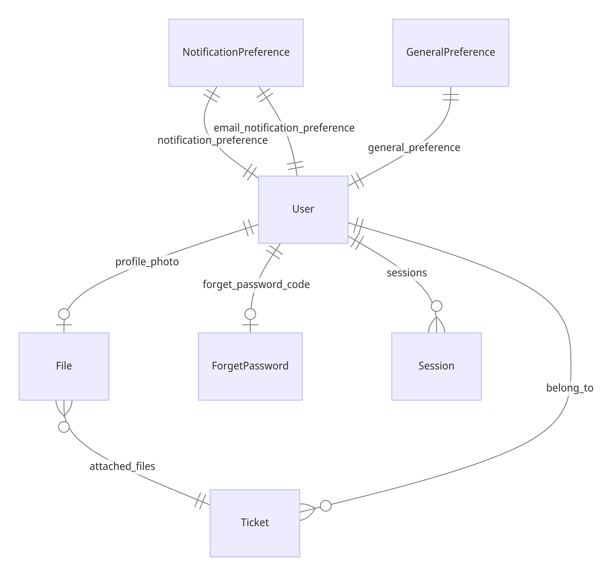
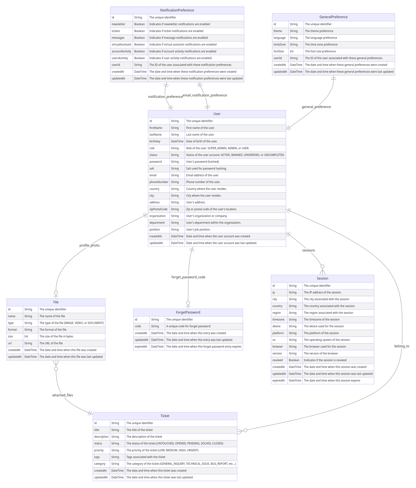
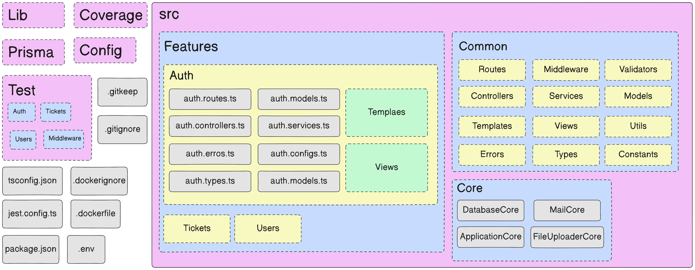
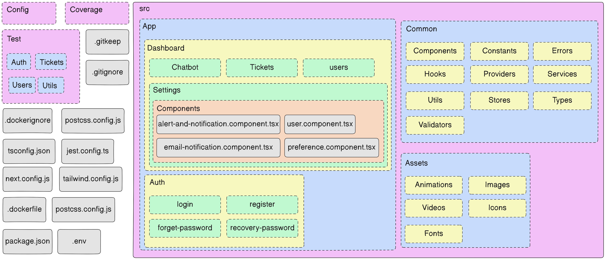

## I-   Overview

### A- Features :

1. **Account Management**:
   
   * User registration, login, and logout.
   * Password recovery and reset mechanisms.
   * User profile management.

2. **Ticket Management**:
   
   * Create, view, update, and close support or service tickets.
   * Prioritize and categorize tickets.
   * Assign tickets to specific team members.

3. **Sessions Management**:
   
   * Implement secure session handling and storage.
   * Allow users to view active sessions and log them out remotely.

4. **Virtual Assistant**:
   
   * Implement a chatbot or AI-driven virtual assistant to provide automated customer support.

5. **Notifications**:
   
   * Send notifications to users via email
   * Allow users to customize their notification preferences.

6. **Permission**:
   
   * Define and manage user roles and permissions.
   * Implement role-based access control (RBAC) for various parts of the application.

7. **User Management**
   

### B- Design and Architecture:

1. **Advanced Folder Architecture**:
   
   * Organize your application into modules or components for better maintainability.

2. **Strong Architecture (MVC + Multi Layer)**:
   
   * Follow the Model-View-Controller (MVC) architecture for clear separation of concerns.
   * Implement additional layers such as service and repository layers for better code organization.

3. **Design Pattern Like (Singleton)**:
   
   * Use design patterns like Singleton, Factory, or Dependency Injection where appropriate.

4. **Configurable Application**:
   
   * Store configuration parameters in a centralized configuration file.
   * Allow configuration to be easily updated without modifying code.

5. **Design**:
   
   * Implement a user-friendly and responsive design for a positive user experience.

### C- Security:

1. **Authorization/Permission (roles & token)**:
   
   * Implement role-based access control (RBAC) and token-based authentication.
   * Ensure that users can only access resources they are authorized for.

2. **Sessions/Tokens Controls**:
   
   * Manage token expiration, refresh tokens, and implement token revocation.
   * Provide notifications for important security-related actions (e.g., new login from a new device).

3. **CORS: Allow/Block Domains**:
   
   * Configure Cross-Origin Resource Sharing (CORS) to control which domains are allowed to access your API.

4. **Rate Limiter**:
   
   * Implement rate limiting to prevent abuse and DDoS attacks.

5. **Validation and Sanitization**:
   
   * Validate and sanitize user inputs to prevent common security vulnerabilities.

6. **Fix Security Vulnerabilities**:
   
   * Regularly update dependencies to address known vulnerabilities.
   * Implement measures to prevent HTTP Parameter Pollution, XSS, clickjacking, and CSRF attacks.

### D- Best Practice:

1. **Clean Code**:
   
   * Follow clean coding practices such as meaningful variable names, proper indentation, and well-organized code structure.

2. **Error & Exception Handling**:
   
   * Implement comprehensive error handling with informative error messages.
   * Use try-catch blocks to handle exceptions gracefully.

## II-  Setup & Installation

### A-  Requirements

1. [NodeJS](https://nodejs.org/) runtime v18.17.0:
   
   - NodeJS is the JavaScript runtime required to run the front/backend of the help desk app.
   
   **Installation:**
   
   1. Visit the NodeJS website: https://nodejs.org/
   
   2. Download the v18.17.0 LTS version for your operating system.
   
   3. Run the installer and follow the on-screen instructions.
   
   4. To verify the installation, open your terminal and run:
      
      ```
      node -v
      npm -v
      ```

2. [Xampp](https://www.apachefriends.org/) v8.2.4:
   
   - Xampp provides the necessary server environment for running the frontend of the help desk app.
   
   **Installation:**
   
   1. Visit the Xampp website: https://www.apachefriends.org/
   
   2. Download the v8.2.4 version for your operating system.
   
   3. Run the installer and follow the on-screen instructions.
   
   4. Start the Apache and MySQL services from the Xampp control panel.
   
   5. To verify the installation, open your web browser and navigate to `http://localhost`.
      
      ### B-  Installation

3. Clone the repository or download the latest release.
   
   ```shell
   git clone https://github.com/NassimBenNsib/HelpDesk-NextJS-ExpressJS-MySQL.git
   ```
   
   #### 1- Server :
   
   ##### a- Setup
   
   ```shell
   # 1. Navigate to the app's directory.
   cd HelpDesk-NextJS-ExpressJS-MySQL/backend/server
   ```

# 2. Install dependencies:

# Choose one of the following commands based on your package manager preference.

npm install

# or

yarn install

# or

pnpm install

# 3. Configure environment variables:

# Copy `.env.example` to `.env` and set necessary values.

cp .env.example .env

# Open `.env` in a text editor and fill in the required values.

# 4. Start the app.

# Use one of the following commands to run the app in development mode.

npm run run:dev:full

# or

yarn run:dev:full

```
##### b- Configuration

###### b1-  Application
```dosini
# Your company's logo, name, address, and contact details
SERVER_COMPANY_LOGO=""
SERVER_COMPANY_NAME=""
SERVER_COMPANY_ADDRESS=""
SERVER_COMPANY_PHONE=""
SERVER_COMPANY_EMAIL=""
SERVER_COMPANY_WEBSITE=""
SERVER_COMPANY_LINKEDIN=""
SERVER_COMPANY_FACEBOOK=""
SERVER_COMPANY_SUPPORT_EMAIL=""
SERVER_COMPANY_SUPPORT_PHONE=""

# The name, version, protocol, host, and port of the app
SERVER_APP_NAME=""
SERVER_APP_VERSION=""
SERVER_APP_PROTOCOL=""
SERVER_APP_HOST=""
SERVER_APP_PORT=""
SERVER_APP_BASE_URL=""

# configurations of app mode
# The mode (development or production) and debugging status
SERVER_APP_MODE="developement"  # Note: There's a typo here, should be "development" instead of "developement"
SERVER_APP_DEBUG=""
```

###### b2- Security

```dosini
#########################################################################
################################ SECURITY ##################################
#########################################################################

# configurations of JWT
# JSON Web Token settings
SERVER_JWT_SECRET_KEY=""
SERVER_JWT_EXPIRES_IN="" # n milliseconds = m days
SERVER_JWT_ALGORITHM="" # 0: HS256, 1: HS384, 2: HS512
SERVER_JWT_NUMBER_OF_CYCLES="" # number of cycles to generate a new token

# configurations of session
# Session settings
SERVER_SESSION_SECRET_KEY=""
SERVER_SESSION_EXPIRES_IN="" # n milliseconds = m days
SERVER_SESSION_ALGORITHM="" # 0: HS256, 1: HS384, 2: HS512

# configurations of forgot password
# Forgot password settings
SERVER_FORGOT_PASSWORD_EXPIRES_IN="" # n milliseconds = m hour
```

###### b3- API

```dosini
#########################################################################
################################# API ####################################
#########################################################################

# configurations of api
# API settings
SERVER_API_PREFIX=""
SERVER_API_VERSION=""
SERVER_API_BASE_URL=""

# configurations of api docs
# API documentation settings
SERVER_API_DOCS_PREFIX=""
SERVER_API_DOCS_VERSION=""
SERVER_API_DOCS_BASE_URL=""
```

###### b4- Database

```dosini
#########################################################################
############################# DATABASE ##################################
#########################################################################

# configurations of DATABASE
# Database connection settings
SERVER_DATABASE_PROTOCOL=""
SERVER_DATABASE_HOST=""
SERVER_DATABASE_PORT=""
SERVER_DATABASE_USER=""
SERVER_DATABASE_PASSWORD=""
SERVER_DATABASE_DATABASE=""
SERVER_DATABASE_BASE_URL=""

# configurations of cache
# Cache connection settings
SERVER_CACHE_PROTOCOL=""
SERVER_CACHE_HOST=""
SERVER_CACHE_PORT=""
SERVER_CACHE_USER=""
SERVER_CACHE_PASSWORD=""
SERVER_CACHE_DATABASE=""
SERVER_CACHE_PREFIX=""
SERVER_CACHE_BASE_URL=""
```

###### b5- Services

```dosini
#########################################################################
############################# SERVICES ##################################
#########################################################################

# configurations of mail
# Email service settings
SERVER_EMAIL_PROTOCOL=""
SERVER_EMAIL_HOST=""
SERVER_EMAIL_PORT=""
SERVER_EMAIL_SECURE=""
SERVER_EMAIL_USER=""
SERVER_EMAIL_PASSWORD=""
```

###### b6- Uploader

```dosini
#############################################################################
############################# FILE UPLOAD ###################################
#############################################################################
# File upload settings for various types

# Cloud storage settings
SERVER_FILE_UPLOAD_FILES_CLOUD_NAME=""
SERVER_FILE_UPLOAD_API_KEY=""
SERVER_FILE_UPLOAD_API_SECRET=""

# Documents upload settings
SERVER_FILE_UPLOAD_DOCUMENTS_FOLDER="documents"
SERVER_FILE_UPLOAD_DOCUMENTS_MAX_SIZE="10 * 1024 * 1024" # 10 MB
SERVER_FILE_UPLOAD_DOCUMENTS_ALLOWED_EXTENSIONS="['pdf', 'doc', 'docx', 'xls', 'xlsx', 'ppt', 'pptx', 'txt','csv','odt']"

# Images upload settings
SERVER_FILE_UPLOAD_IMAGES_FOLDER="images"
SERVER_FILE_UPLOAD_IMAGES_MAX_SIZE="2 * 1024 * 1024" # 2 MB
SERVER_FILE_UPLOAD_IMAGES_ALLOWED_EXTENSIONS="['png', 'jpg', 'jpeg', 'gif']"

# Audios upload settings
SERVER_FILE_UPLOAD_AUDIOS_FOLDER="audios"
SERVER_FILE_UPLOAD_AUDIOS_MAX_SIZE="10 * 1024 * 1024" # 10 MB
SERVER_FILE_UPLOAD_AUDIOS_ALLOWED_EXTENSIONS="['mp3', 'wav', 'wma', 'aac', 'flac']"

# Videos upload settings
SERVER_FILE_UPLOAD_VIDEOS_FOLDER="videos"
SERVER_FILE_UPLOAD_VIDEOS_MAX_SIZE="50 * 1024 * 1024" # 50 MB
SERVER_FILE_UPLOAD_VIDEOS_ALLOWED_EXTENSIONS="['mp4', 'mov', 'avi', 'wmv', 'flv', 'mkv', 'webm']"
```

##### c- Scripts

###### c1- Init Scripts

- `[init]`: A visual separator for the init section.
- `run:init:full`: Initializes both the Jest testing framework and the Prisma database client.
- `run:init:database`: Initializes the Prisma database client.

###### c2- Test Scripts

- `[test]`: A visual separator for the test section.
- `run:jest`: Executes Jest tests.
- `run:test:full`: Executes Jest tests with various options including watching, verbose output, coverage tracking, handling open handles, and running in a single thread.

###### c3- Migrate Scripts

- `[migrate]`: A visual separator for the migrate section.
- `run:migrate:database`: Performs migration of the Prisma database with the "init" name.
- `run:migrate:model`: Generates Prisma models.
- `run:migrate:full`: Combines migration of the Prisma database and generation of models using the "init" name.

###### c4- Development Scripts

- `[dev]`: A visual separator for the development section.
- `run:dev`: Launches the application in development mode using ts-node-dev with transpilation and respawn.
- `run:dev:full`: Integrates migration, model generation, and running the app for development.

###### c5- Build Scripts

- `[build]`: A visual separator for the build section.
- `run:build`: Compiles TypeScript files using the TypeScript compiler (tsc).
- `run:build:full`: Same as run:build.

###### c6- Production Scripts

- `[production]`: A visual separator for the production section.
- `run:prod:full`: Initiates the compiled application in production mode.
- `run:prod`: Same as run:prod:full.

###### c7-Tools Scripts

- `[tools]`: A visual separator for the tools section.
- `run:prisma:studio`: Launches Prisma Studio for visual database management.

##### d- Screenshot

#### 2- Chatbot :

##### a- Setup

```shell
# 1. Navigate to the app's directory.
cd HelpDesk-NextJS-ExpressJS-MySQL/backend/chatbot

# 2. Install dependencies:
# Choose one of the following commands based on your package manager preference.
npm install
# or
yarn install
# or
pnpm install

# 3. Configure environment variables: 
# Copy `.env.example` to `.env` and set necessary values.
cp .env.example .env
# Open `.env` in a text editor and fill in the required values.

# 4. Start the app.
# Use one of the following commands to run the app in development mode.
npm run run:dev:full
# or
yarn run:dev:full
```

##### b- Configuration

```dosini
################################ APP ####################################
#########################################################################

#configuration of company
# The company logo, name, address, and contact details
COMPANY_LOGO=""
COMPANY_NAME=""
COMPANY_ADDRESS=""
COMPANY_PHONE=""
COMPANY_EMAIL=""
COMPANY_WEBSITE=""
COMPANY_LINKEDIN=""
COMPANY_FACEBOOK=""
COMPANY_SUPPORT_EMAIL=""
COMPANY_SUPPORT_PHONE=""

# configurations of app
# The name, version, protocol, host, and port of the app
APP_NAME=""
APP_VERSION="1.0.0"
APP_PROTOCOL="http"
APP_HOST="0.0.0.0"
APP_PORT="9000"
APP_BASE_URL="http://localhost:9000"

# configurations of app mode
# The mode (development or production) and debugging status
APP_MODE=""
APP_DEBUG="true"

#########################################################################
################################ API ####################################
#########################################################################
# API prefix, version, and base URL
API_PREFIX="/api/"
API_VERSION="v1"
API_BASE_URL="http://localhost:9000/api/v1"

#########################################################################
################################ CORS ###################################
#########################################################################
# Cross-Origin Resource Sharing (CORS) settings
CORS_ORIGINS="*"
CORS_METHODS="*"
CORS_ALLOWED_HEADERS="*"
CORS_ALLOWED_METHODS="*"

#########################################################################
##########################  OPEN_AI     #################################
# OpenAI API key for integration
OPENAI_API_KEY=''
```

##### c- Screenshot

#### 3- Client

##### a- Setup

```shell
# 1. Navigate to the app's directory.
cd HelpDesk-NextJS-ExpressJS-MySQL/frontend/client

# 2. Install dependencies:
# Choose one of the following commands based on your package manager preference.
npm install
# or
yarn install
# or
pnpm install

# 3. Configure environment variables: 
# Copy `.env.example` to `.env` and set necessary values.
cp .env.example .env.local
# Open `.env` in a text editor and fill in the required values.

# 4. Start the app.
# Use one of the following commands to run the app in development mode.
npm run run:dev:full
# or
yarn run:dev:full
```

##### b- Configuration

```dosini
# ================ Frontend (Client Side) environment variables ================

# API environment variables
NEXT_PUBLIC_BACKEND_API_PROTOCOL=
NEXT_PUBLIC_BACKEND_API_BASE_URL=
NEXT_PUBLIC_BACKEND_API_PORT=
NEXT_PUBLIC_BACKEND_API_PREFIX=
NEXT_PUBLIC_BACKEND_API_VERSION=

# Database environment variables

# Application variables
NEXT_PUBLIC_MODE=
```

## III- Screenshot


## IV- Architecture & UML

### UML

#### Use Case Diagram


#### Class Diagram


#### Entity Relationship Diagram



#### Entity Relationship Details Diagram

The ER diagram above represents the structure of key entities, attributes and relationships in our system. The diagram was developed to provide a visual illustration of how data is organized and interconnected within the system.

1-  **NotificationPreference**
This entity represents a user's notification preferences, which define what type of notifications the user wishes to receive. These preferences include options such as newsletters, ticket notifications, messages, account activities and user activities.

2-  **EmailNotificationPreference** 
This entity is an extension of "NotificationPreference" and represents preferences specific to e-mail notifications. It is used to manage preferences concerning notifications sent by e-mail.

3-  **GeneralPreference**
General user preferences are stored in this entity. They include settings such as theme, language, time zone and font size.

4-  **File**
The "File" entity represents files downloaded or attached to the system. Attributes include details of file name, type, format, size and URL.

5-  **Ticket**
This entity is used to manage tickets or service requests submitted by users. Attributes include information such as ticket title, description, status, priority, tags and category.

6-  **User**
The "User" entity represents system users. It stores personal information such as name, date of birth, etc.



- |o    o| :    Zero or one
- ||    || :    Exactly one
- }o    o{ :    Zero or more (no upper limit)
- }|    |{ :    One or more (no upper limit)

This ER diagram provides a detailed view of the system's data structure, showing how entities relate to each other and how user data, notification preferences, tickets, files and sessions are managed and organized. This visual representation is invaluable for understanding how data is stored and interacts within the system.

### Folder Structure

#### Backend



#### Frontend



## V- Tools

- Development
  
  - [VS Code](https://code.visualstudio.com/)
  - Frontend
    - [ReactJS](https://react.dev/)
    - [NextJS](https://nextjs.org/)
    - [Typescript](https://www.typescriptlang.org/)
    - [TailwindCSS](https://tailwindcss.com/)
    - [Shadcn/ui](https://ui.shadcn.com/)
  - Backend
    - [NodeJS](https://nodejs.org/)
    - [ExpressJS](https://expressjs.com/)
    - [Typescript](https://www.typescriptlang.org/)
    - [Open API](https://openai.com/) (ChatGPT) 

- Versioning
  
  - [GitHub](https://github.com/)
  - [Git](https://git-scm.com/)

- Database
  
  - [MySQL](https://www.mysql.com/)
  - [Prisma](https://www.prisma.io/)
  - [Prisma Studio](https://www.prisma.io/studio)

- Testing
  
  - [REST Client](https://marketplace.visualstudio.com/items?itemName=humao.rest-client) (VS Code Extension) 
  - [Jest](https://jestjs.io/)

- Project Management & Collaboration
  
  - [Trello](https://trello.com/)
  - [Google Meet](https://meet.google.com/)

- Documentation
  
  - [Mermaid](https://mermaid.js.org/) (Language & Editor )
    
          - Diagrams (class diagram, git graph, entity relationship)
  
  - [Draw.io](https://draw.io/) (use case diagrams)
  
  - [UML](https://www.uml.org/)
